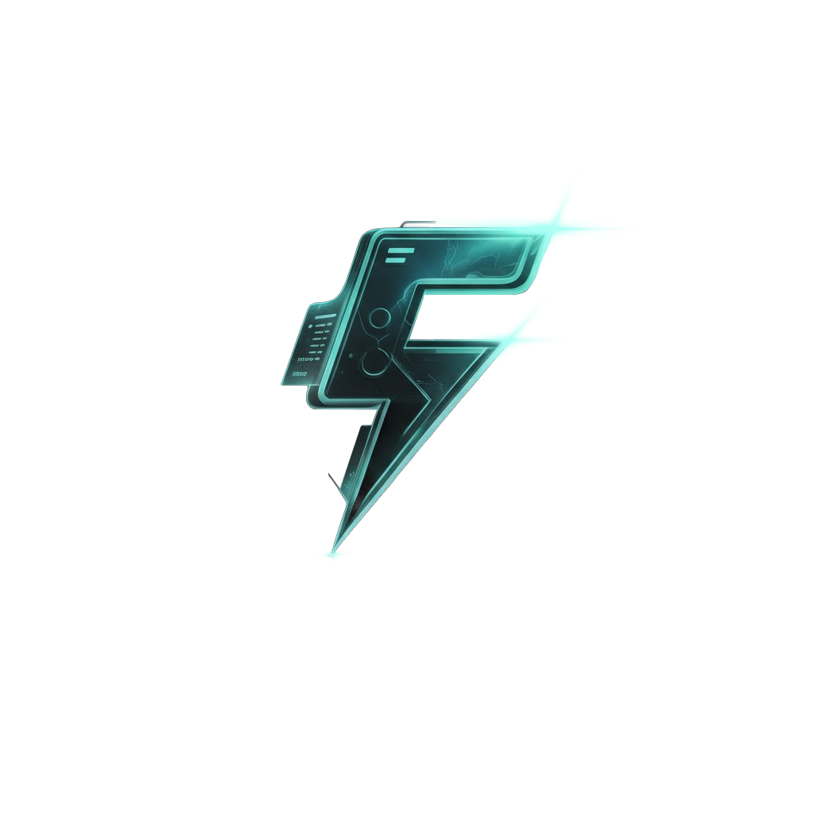

<a id="readme-top"></a>

<!-- PROJECT SHIELDS -->
<div align="center">

<a href="https://github.com/duytran1406/flasharr/graphs/contributors"></a>
<a href="https://github.com/duytran1406/flasharr/network/members"></a>
<a href="https://github.com/duytran1406/flasharr/stargazers"></a>
<a href="https://github.com/duytran1406/flasharr/issues"></a>
<a href="https://github.com/duytran1406/flasharr/blob/main/LICENSE"></a>

</div>

<!-- PROJECT LOGO -->
<br />
<div align="center">
  <a href="https://github.com/duytran1406/flasharr">
    
  </a>

  <h1>Flasharr</h1>

  <p>
    <strong>Blazing-fast download manager with Sonarr & Radarr integration</strong>
    <br />
    Built with Rust + SvelteKit · TMDB metadata built-in · Docker ready
    <br />
    <br />
    <a href="docs/INSTALLATION_GUIDE.md"><strong>📖 Installation Guide »</strong></a>
    <br />
    <br />
    <a href="docs/api-reference.md">API Reference</a>
    ·
    <a href="https://github.com/duytran1406/flasharr/issues/new?labels=bug&template=bug-report.md">Report Bug</a>
    ·
    <a href="https://github.com/duytran1406/flasharr/issues/new?labels=enhancement&template=feature-request.md">Request Feature</a>
  </p>
</div>

<!-- TABLE OF CONTENTS -->
<details>
  <summary><strong>Table of Contents</strong></summary>
  <ol>
    <li><a href="#about-the-project">About The Project</a></li>
    <li><a href="#built-with">Built With</a></li>
    <li><a href="#getting-started">Getting Started</a></li>
    <li><a href="#usage">Usage</a></li>
    <li><a href="#arr-integration">*arr Integration</a></li>
    <li><a href="#docker-tags">Docker Tags</a></li>
    <li><a href="#roadmap">Roadmap</a></li>
    <li><a href="#contributing">Contributing</a></li>
    <li><a href="#license">License</a></li>
    <li><a href="#acknowledgments">Acknowledgments</a></li>
    <li><a href="#-buy-me-a-coffee">Buy Me a Coffee</a></li>
  </ol>
</details>

---

<!-- ABOUT THE PROJECT -->

## About The Project

<!-- Add screenshots here when available -->
<!--  -->

Flasharr is a high-performance download manager designed for the home media enthusiast. It downloads files from Fshare.vn at full VIP speeds and integrates seamlessly with the \*arr ecosystem (Sonarr, Radarr) for fully automated media management.

**Why Flasharr?**

- ⚡ **300 MB/s** download speeds with a Rust-powered backend
- 🪶 **~30 MB** idle memory — runs on anything from a Raspberry Pi to a NAS
- 🎬 **Sonarr & Radarr** compatible — acts as both a Newznab indexer and SABnzbd download client
- 🔍 **TMDB metadata built-in** — no API key configuration needed
- 📡 **Real-time WebSocket** updates — watch your downloads progress live
- 🐳 **Docker-first** — one command to get running
- 💎 **Modern UI** — dark-themed SvelteKit interface with responsive design

<p align="right">(<a href="#readme-top">back to top</a>)</p>

<!-- BUILT WITH -->

## Built With

[![Rust][Rust-badge]][Rust-url]
[![SvelteKit][Svelte-badge]][Svelte-url]
[![SQLite][SQLite-badge]][SQLite-url]
[![Docker][Docker-badge]][Docker-url]
[![TypeScript][TypeScript-badge]][TypeScript-url]

<p align="right">(<a href="#readme-top">back to top</a>)</p>

---

<!-- GETTING STARTED -->

## Getting Started

### Prerequisites

- **Docker** and **Docker Compose** — [Get Docker](https://docs.docker.com/get-docker/)
- **Fshare VIP account** — [fshare.vn](https://www.fshare.vn/)
- **Sonarr/Radarr** _(optional)_ — for automated media management

### Quick Install

**One-line install:**

```bash
curl -sSL https://raw.githubusercontent.com/duytran1406/flasharr/main/install.sh | bash
```

**Docker Compose:**

```bash
mkdir -p ~/flasharr && cd ~/flasharr
curl -O https://raw.githubusercontent.com/duytran1406/flasharr/main/docker-compose.production.yml
mv docker-compose.production.yml docker-compose.yml
docker compose up -d
```

**Docker Run:**

```bash
docker run -d \
  --name flasharr \
  -p 8484:8484 \
  -v ./appData:/appData \
  -v /path/to/flasharr-download:/downloads \
  -v /path/to/flasharr-download:/data/flasharr-download \
  -e FLASHARR_SYMLINK_REAL_BASE=/data/flasharr-download \
  -e PUID=911 \
  -e PGID=911 \
  -e UMASK=002 \
  --restart unless-stopped \
  ghcr.io/duytran1406/flasharr:latest
```

Open `http://localhost:8484` and complete the setup wizard.

> 📖 **New to Docker?** See the [**Complete Installation Guide**](docs/INSTALLATION_GUIDE.md) for step-by-step instructions with screenshots.

<p align="right">(<a href="#readme-top">back to top</a>)</p>

---

<!-- USAGE -->

## Usage

### First-Time Setup

1. Open `http://localhost:8484`
2. Complete the **Setup Wizard**:
   - Enter Fshare credentials (VIP account required)
   - Configure download path and concurrency
   - Optionally connect Sonarr, Radarr, Jellyfin
3. Get your **API key** from Settings → Services

### Environment Variables

| Variable                      | Default                         | Description                                         |
| ----------------------------- | ------------------------------- | --------------------------------------------------- |
| `FLASHARR_APPDATA_DIR`        | `/appData`                      | Data directory                                      |
| `FLASHARR_SYMLINK_REAL_BASE`  | unset                           | Shared download path visible to Sonarr/Radarr       |
| `PUID`                        | `911`                           | Runtime user id                                     |
| `PGID`                        | `911`                           | Runtime group id                                    |
| `UMASK`                       | `002`                           | File creation mask for group-writable media stacks  |
| `FLASHARR_RUN_AS_ROOT`        | `false`                         | Emergency compatibility mode for locked-down hosts  |
| `RUST_LOG`                    | `flasharr=info,tower_http=info` | Log level                                           |
| `TZ`                          | `UTC`                           | Timezone                                            |

### Volume Mounts

| Host Path                    | Container Path            | Purpose                            |
| ---------------------------- | ------------------------- | ---------------------------------- |
| `./appData`                  | `/appData`                | Database & config                  |
| `/path/to/flasharr-download` | `/downloads`              | Download-client compatibility path |
| `/path/to/flasharr-download` | `/data/flasharr-download` | Sonarr/Radarr-visible import path  |

For Sonarr/Radarr automation, mount the same host download folder into Flasharr
and the Arr containers at the same visible path. Flasharr asks Sonarr/Radarr to
import completed downloads from `/data/flasharr-download`, then waits for Arr
history before marking the item imported.

<p align="right">(<a href="#readme-top">back to top</a>)</p>

---

<!-- ARR INTEGRATION -->

## \*arr Integration

Flasharr integrates with Sonarr and Radarr as both a **Newznab Indexer** (search) and a **SABnzbd Download Client** (automated downloads).

| Setting             | Sonarr                             | Radarr                             |
| ------------------- | ---------------------------------- | ---------------------------------- |
| **Indexer URL**     | `http://flasharr:8484/api/newznab` | `http://flasharr:8484/api/newznab` |
| **Categories**      | `5000,5030,5040`                   | `2000,2040,2045`                   |
| **Download Client** | SABnzbd                            | SABnzbd                            |
| **Host**            | `flasharr`                         | `flasharr`                         |
| **Port**            | `8484`                             | `8484`                             |
| **URL Base**        | `/sabnzbd`                         | `/sabnzbd`                         |
| **Category**        | `tv`                               | `movies`                           |

> 📖 **Need the full walkthrough?** See the [Installation Guide → Steps 7 & 8](docs/INSTALLATION_GUIDE.md#-step-7--add-flasharr-to-sonarr-tv-shows)

<p align="right">(<a href="#readme-top">back to top</a>)</p>

---

<!-- DOCKER TAGS -->

## Docker Tags

| Tag       | Description                  | Updates           |
| --------- | ---------------------------- | ----------------- |
| `stable`  | Production recommended       | On releases       |
| `latest`  | Latest build from main       | On push to main   |
| `nightly` | Daily development build      | Daily at 2 AM UTC |
| `v3.0.0`  | Specific version (immutable) | Never             |
| `preprod` | Pre-production testing       | Manual            |

### Updating

```bash
docker compose pull && docker compose up -d
```

<p align="right">(<a href="#readme-top">back to top</a>)</p>

---

<!-- PERFORMANCE -->

## Performance

| Metric          | Value          |
| --------------- | -------------- |
| Memory (Idle)   | ~30 MB         |
| Memory (Active) | ~100 MB        |
| CPU (Idle)      | < 0.5%         |
| Download Speed  | Up to 300 MB/s |
| Startup Time    | ~0.2s          |

<p align="right">(<a href="#readme-top">back to top</a>)</p>

---

<!-- ROADMAP -->

## Roadmap

- [x] Multi-host download engine (Fshare)
- [x] Sonarr & Radarr integration (Newznab + SABnzbd)
- [x] TMDB metadata enrichment
- [x] Real-time WebSocket progress
- [x] Batch downloads (Smart Grab)
- [x] Auto-retry with exponential backoff
- [ ] Jellyfin library sync
- [ ] Multi-language search support
- [ ] Additional host providers
- [ ] Mobile-friendly PWA

See the [open issues](https://github.com/duytran1406/flasharr/issues) for a full list of proposed features and known issues.

<p align="right">(<a href="#readme-top">back to top</a>)</p>

---

<!-- DOCUMENTATION -->

## Documentation

| Guide                                               | Description                  |
| --------------------------------------------------- | ---------------------------- |
| 📖 [Installation Guide](docs/INSTALLATION_GUIDE.md) | Complete setup for beginners |
| 🔧 [API Reference](docs/api-reference.md)           | REST API endpoints           |
| 📡 [WebSocket Protocol](docs/websocket-protocol.md) | Real-time update protocol    |

<p align="right">(<a href="#readme-top">back to top</a>)</p>

---

<!-- TROUBLESHOOTING -->

## Troubleshooting

<details>
<summary><b>Container won't start</b></summary>

```bash
docker logs flasharr
lsof -i :8484        # Check if port is in use
ls -la ./appData     # Check permissions
```

</details>

<details>
<summary><b>Sonarr/Radarr can't connect</b></summary>

- Ensure containers are on the same Docker network
- Use the machine's IP instead of `flasharr` if in separate compose files
- Check API key matches: Flasharr Settings → Services

</details>

<details>
<summary><b>Downloads not starting</b></summary>

- Verify Fshare VIP subscription is active
- Check credentials in Settings → Fshare
- View logs: `docker logs flasharr | grep -i error`

</details>

<p align="right">(<a href="#readme-top">back to top</a>)</p>

---

<!-- CONTRIBUTING -->

## Contributing

Contributions are what make the open-source community amazing. Any contributions you make are **greatly appreciated**.

1. Fork the Project
2. Create your Feature Branch (`git checkout -b feature/amazing-feature`)
3. Commit your Changes (`git commit -m 'feat: add amazing feature'`)
4. Push to the Branch (`git push origin feature/amazing-feature`)
5. Open a Pull Request

> **Note:** This project uses [Conventional Commits](https://www.conventionalcommits.org/) for automatic versioning. Prefix your commits with `feat:`, `fix:`, `docs:`, etc.

<p align="right">(<a href="#readme-top">back to top</a>)</p>

---

<!-- LICENSE -->

## License

Distributed under the MIT License. See [LICENSE](LICENSE) for more information.

<p align="right">(<a href="#readme-top">back to top</a>)</p>

---

<!-- ACKNOWLEDGMENTS -->

## Acknowledgments

- [Sonarr](https://sonarr.tv/) & [Radarr](https://radarr.video/) — The amazing \*arr ecosystem
- [TMDB](https://www.themoviedb.org/) — Media metadata API
- [Fshare](https://www.fshare.vn/) — Vietnamese file hosting service
- [Best-README-Template](https://github.com/othneildrew/Best-README-Template) — README structure inspiration

<p align="right">(<a href="#readme-top">back to top</a>)</p>

---

<!-- BUY ME A COFFEE -->

## ☕ Buy Me a Coffee

If you find Flasharr useful, consider buying me a coffee! Scan the QR code below:

<div align="center">
  
  <br />
  <sub>Thank you for your support! 🙏</sub>
</div>

<p align="right">(<a href="#readme-top">back to top</a>)</p>

<!-- MARKDOWN LINKS & IMAGES -->

[contributors-shield]: https://img.shields.io/github/contributors/duytran1406/flasharr.svg?style=for-the-badge
[contributors-url]: https://github.com/duytran1406/flasharr/graphs/contributors
[forks-shield]: https://img.shields.io/github/forks/duytran1406/flasharr.svg?style=for-the-badge
[forks-url]: https://github.com/duytran1406/flasharr/network/members
[stars-shield]: https://img.shields.io/github/stars/duytran1406/flasharr.svg?style=for-the-badge
[stars-url]: https://github.com/duytran1406/flasharr/stargazers
[issues-shield]: https://img.shields.io/github/issues/duytran1406/flasharr.svg?style=for-the-badge
[issues-url]: https://github.com/duytran1406/flasharr/issues
[license-shield]: https://img.shields.io/github/license/duytran1406/flasharr.svg?style=for-the-badge
[license-url]: https://github.com/duytran1406/flasharr/blob/main/LICENSE
[Rust-badge]: https://img.shields.io/badge/Rust-000000?style=for-the-badge&logo=rust&logoColor=white
[Rust-url]: https://www.rust-lang.org/
[Svelte-badge]: https://img.shields.io/badge/SvelteKit-FF3E00?style=for-the-badge&logo=svelte&logoColor=white
[Svelte-url]: https://kit.svelte.dev/
[SQLite-badge]: https://img.shields.io/badge/SQLite-003B57?style=for-the-badge&logo=sqlite&logoColor=white
[SQLite-url]: https://www.sqlite.org/
[Docker-badge]: https://img.shields.io/badge/Docker-2496ED?style=for-the-badge&logo=docker&logoColor=white
[Docker-url]: https://www.docker.com/
[TypeScript-badge]: https://img.shields.io/badge/TypeScript-3178C6?style=for-the-badge&logo=typescript&logoColor=white
[TypeScript-url]: https://www.typescriptlang.org/
