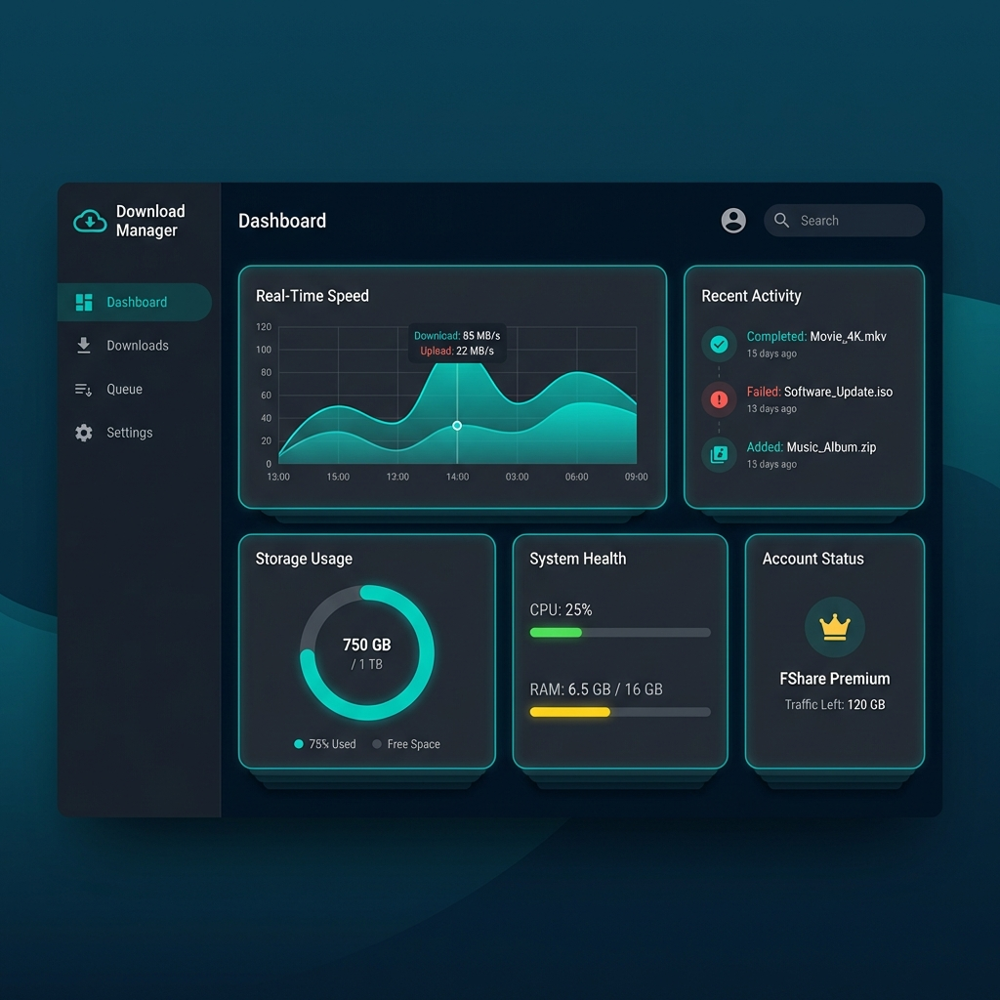
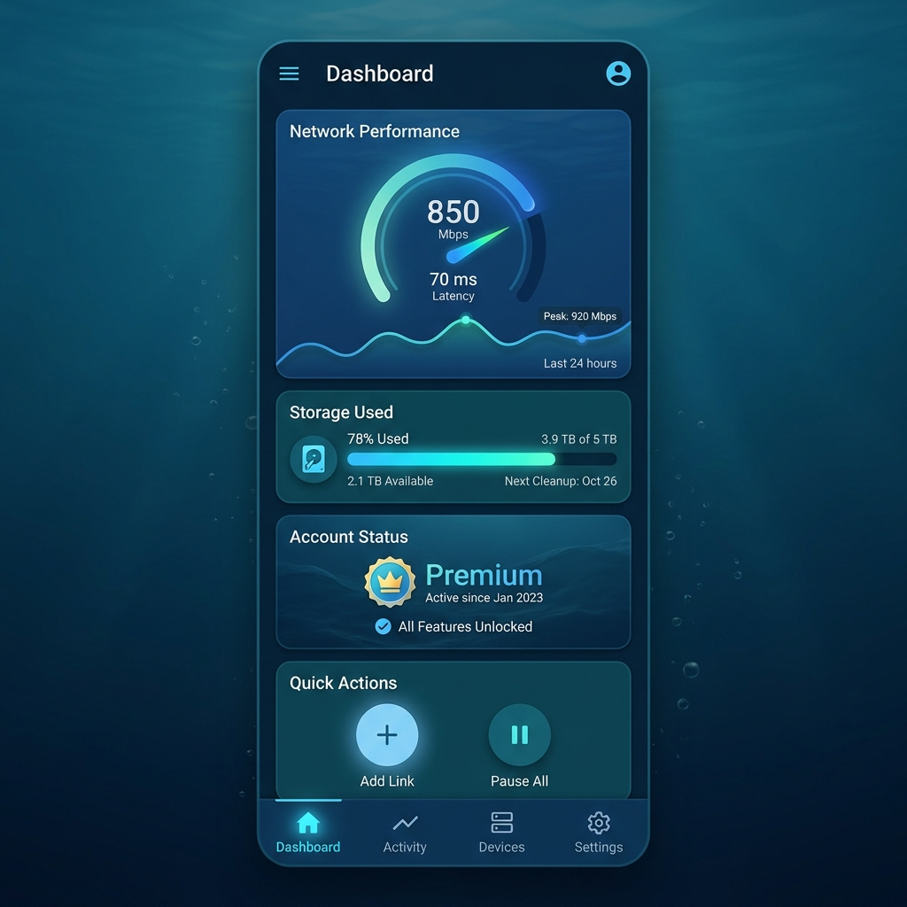
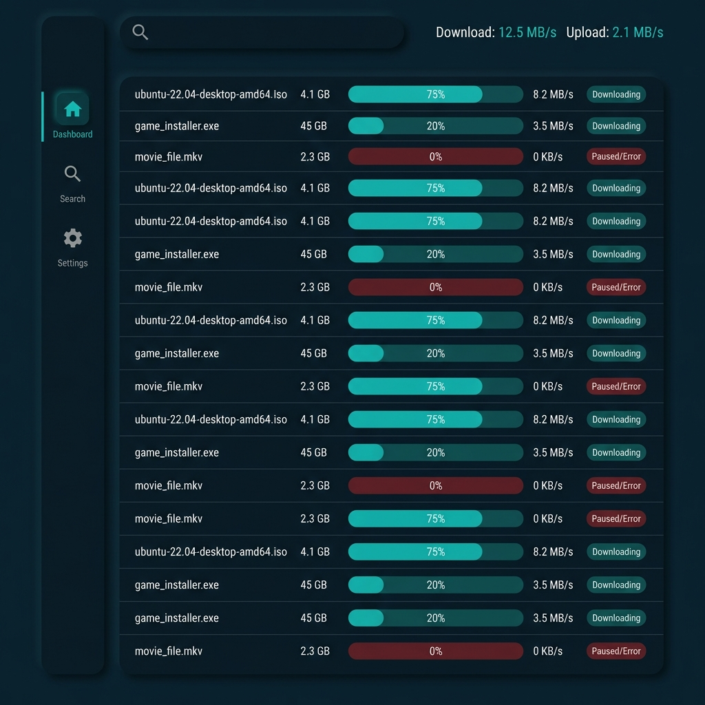
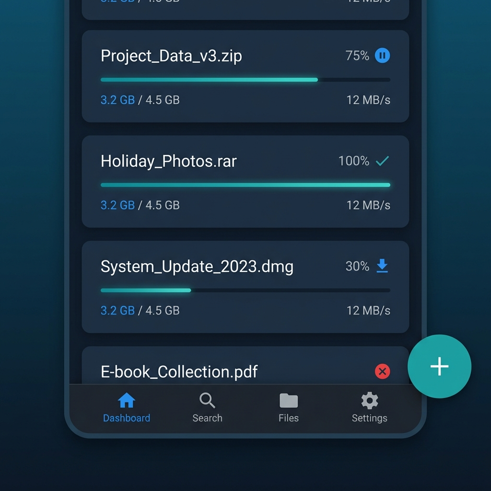

# OceanLoad Design Specification
*Living document for UI/UX decisions.*

## Current Feature: OceanLoad UI Revision (v2.1: Split View)
**Status:** Draft

### 1. UX Rationale
The user requested a clear separation between the "Command Center" (Stats) and the "Downloader" (File Operations). The App is now split into two core views:

#### A. The Dashboard (Command Center)
*   **Purpose:** High-level overview, system health, and real-time metrics.
*   **Key Widgets:**
    *   **Real-time Speed Graph:** Area chart showing throughput over time.
    *   **Storage Usage:** Donut chart for disk capacity.
    *   **Recent Activity:** Quick log of finished/failed downloads.
    *   **Account Status:** Premium validity and Traffic left.

#### B. The Downloader (File Manager)
*   **Purpose:** Dense data grid for managing file transfers.
*   **Layout:** Sidebar + Dense Data Table (Desktop) / Card List (Mobile).
*   **Add Action:** Located in Sidebar (Desktop) or Header/BottomBar (Mobile). No FAB.

### 2. Proposed Wireframes

#### Dashboard (Stats View)
**Desktop:**

**Mobile:**

#### Downloader (List View)
**Desktop:**

**Mobile:**

### 3. User Feedback
*   **Rev 1:** "Remove FAB." -> *Action:* Done.
*   **Rev 2:** "Split dashboard with downloader." -> *Action:* Created separate Dashboard view.