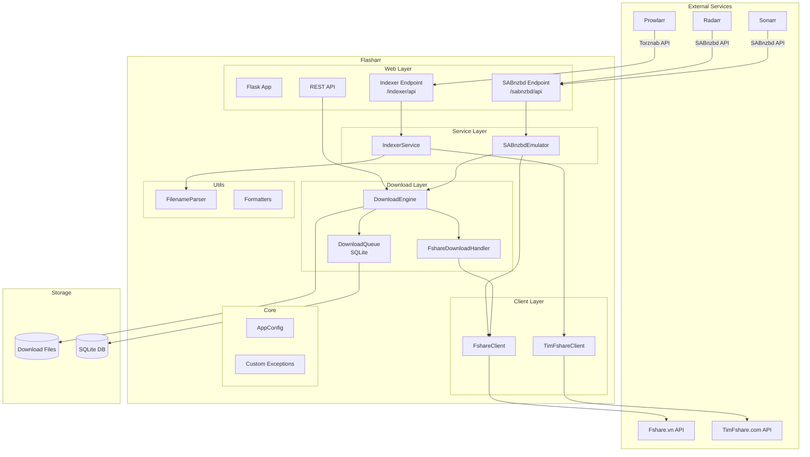

# Flasharr - Architecture Document

## High-Level Architecture

## Data Flow

### Search Flow (Prowlarr → Indexer)
1. Prowlarr sends Torznab search request to `/indexer/api?t=search&q=...`
2. `IndexerService` receives request and builds search query
3. `TimFshareClient` queries TimFshare.com API
4. Results are scored, filtered, and normalized using `FilenameParser`
5. XML response returned in Torznab format

### Download Flow (*arr → SABnzbd → Engine)
1. Radarr/Sonarr sends download request to `/sabnzbd/api?mode=addurl&name=...`
2. `SABnzbdEmulator` receives Fshare URL
3. `FshareClient` resolves direct download link
4. `DownloadEngine` queues the download
5. Async download worker processes the queue
6. Progress updates stored in SQLite via `DownloadQueue`

## Component Responsibilities

| Component | Responsibility |
|-----------|----------------|
| `FshareClient` | Fshare authentication, file info, direct link resolution |
| `TimFshareClient` | Search TimFshare.com with relevance scoring |
| `IndexerService` | Torznab/Newznab API implementation |
| `SABnzbdEmulator` | SABnzbd API compatibility layer |
| `DownloadEngine` | Async concurrent download management |
| `DownloadQueue` | SQLite-based task persistence |
| `FshareDownloadHandler` | Fshare URL validation and resolution |
| `FilenameParser` | Media filename normalization for *arr |
| `AppConfig` | Centralized configuration management |

## Technology Stack

- **Backend**: Python 3.9+, Flask, aiohttp, SQLite
- **API Standards**: Torznab, Newznab, SABnzbd
- **Container**: Docker (single unified image)
- **Storage**: SQLite for queue, filesystem for downloads
