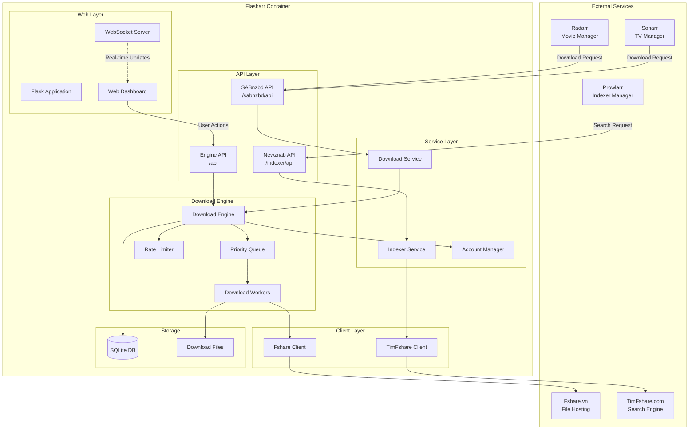
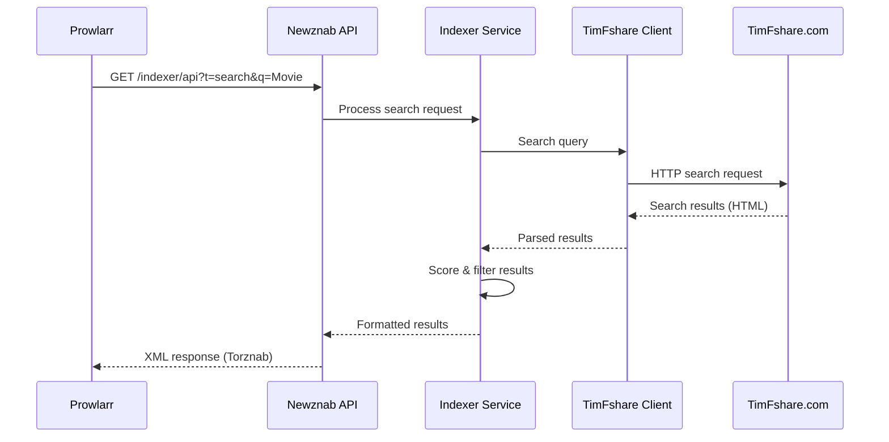
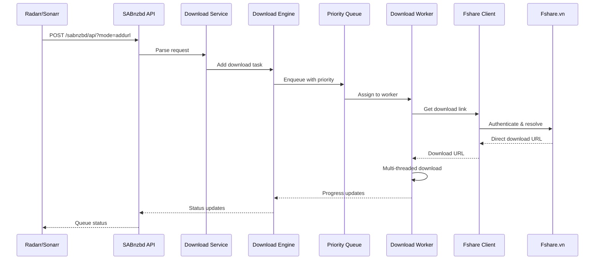

# System Overview

Flasharr is a bridge service that integrates Fshare.vn with the *arr media management ecosystem.

---

## Architecture Diagram

---

## Core Components

### 1. Web Layer

**Flask Application**
- Serves web UI and API endpoints
- Handles routing and request processing
- Manages WebSocket connections

**Web Dashboard**
- Modern UI for download management
- Real-time progress updates
- Configuration interface

**WebSocket Server**
- Pushes real-time updates to clients
- Notifies on download state changes
- Broadcasts system events

---

### 2. API Layer

**Newznab API** (`/indexer/api`)
- Implements Newznab/Torznab specification
- Integrates with Prowlarr
- Returns search results in XML format

**SABnzbd API** (`/sabnzbd/api`)
- Emulates SABnzbd download client
- Integrates with Radarr/Sonarr
- Manages download queue and history

**Engine API** (`/api`)
- Direct download engine control
- RESTful endpoints for management
- Statistics and monitoring

---

### 3. Service Layer

**Indexer Service**
- Processes search requests
- Queries TimFshare search engine
- Scores and filters results
- Formats responses for *arr apps

**Download Service**
- Handles download requests from *arr apps
- Validates Fshare URLs
- Queues downloads with priority
- Manages download lifecycle

**Account Manager**
- Manages multiple Fshare VIP accounts
- Load balances across accounts
- Detects quota limits
- Rotates accounts automatically

---

### 4. Client Layer

**Fshare Client**
- Authenticates with Fshare.vn
- Resolves direct download links
- Retrieves file metadata
- Handles API rate limiting

**TimFshare Client**
- Searches TimFshare.com
- Implements relevance scoring
- Filters by file type
- Caches search results

---

### 5. Download Engine

**Download Engine**
- Manages concurrent downloads
- Implements multi-threaded downloading
- Enforces global speed limits
- Tracks download progress

**Priority Queue**
- Prioritizes downloads (LOW, NORMAL, HIGH, URGENT)
- Auto-prioritizes small files
- Maintains download order
- Persists queue to SQLite

**Download Workers**
- Executes downloads asynchronously
- Supports segmented downloads
- Handles resume/retry logic
- Reports progress in real-time

**Rate Limiter**
- Enforces global bandwidth limits
- Token bucket algorithm
- Configurable speed limits
- Per-download throttling

---

## Data Flow

### Search Flow (Prowlarr → Indexer)

**Steps:**
1. Prowlarr sends search request to Newznab API
2. Indexer Service receives and validates request
3. TimFshare Client queries TimFshare.com
4. Results are parsed and scored
5. Results filtered by relevance and file type
6. Response formatted as Torznab XML
7. Prowlarr receives and displays results

---

### Download Flow (Radarr/Sonarr → SABnzbd → Engine)

**Steps:**
1. *arr app sends download request with Fshare URL
2. SABnzbd API parses and validates request
3. Download Service creates download task
4. Engine adds task to priority queue
5. Worker picks up task from queue
6. Fshare Client authenticates and resolves direct link
7. Worker downloads file using multiple segments
8. Progress updates sent via WebSocket
9. *arr app polls for status updates

---

## Technology Stack

| Layer | Technology |
|-------|------------|
| **Backend** | Python 3.9+, Flask, aiohttp |
| **Database** | SQLite |
| **WebSocket** | Flask-SocketIO |
| **API Standards** | Newznab, Torznab, SABnzbd |
| **Container** | Docker, Docker Compose |
| **Download** | aiohttp, asyncio |

---

## Design Principles

### 1. Compatibility First
- Strict adherence to Newznab/SABnzbd specifications
- Maximum compatibility with *arr applications
- Graceful degradation for unsupported features

### 2. Performance
- Asynchronous I/O for all network operations
- Multi-threaded downloads for maximum speed
- Efficient caching to reduce API calls
- Connection pooling and reuse

### 3. Reliability
- Persistent queue survives restarts
- Automatic retry on transient failures
- Account rotation on quota limits
- Comprehensive error handling

### 4. Scalability
- Multi-account support for load distribution
- Configurable concurrency limits
- Resource-aware dynamic scaling
- Efficient database indexing

### 5. User Experience
- Real-time progress updates
- Intuitive web dashboard
- Comprehensive logging
- Clear error messages

---

## Security Considerations

### Credential Storage
- Credentials stored in environment variables
- No plaintext passwords in code
- Secure session management with Fshare

### Network Security
- HTTPS support for external access
- Configurable bind address
- No exposed credentials in logs

### Input Validation
- All user inputs sanitized
- URL validation before download
- File path traversal prevention

---

## Scalability & Limits

| Resource | Limit | Configurable |
|----------|-------|--------------|
| Concurrent Downloads | 2 (default) | Yes |
| Segments per Download | 4 (default) | Yes |
| Max Queue Size | Unlimited | No |
| Search Results | 100 (default) | Yes |
| Fshare Accounts | Unlimited | Yes |

---

## Next Steps

- [Download Engine](download-engine.md) - Deep dive into download system
- [Account Manager](account-manager.md) - Multi-account architecture
- [WebSocket System](websocket-system.md) - Real-time updates
- [Integration Flow](integration-flow.md) - Complete integration guide
